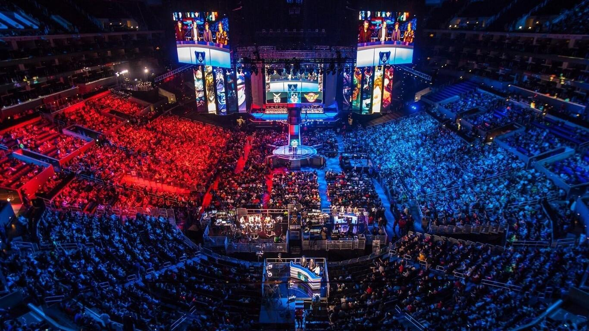

**Proyecto Final curso de Data Science - LoL e-sports**

Análisis de ligas profesionales de League of Leguends realizado en el marco del curso de Data Science de Coderhouse

- [Presentación del problema](#presentación-del-problema)
- [Objetivo de la investigación](#objetivo-de-la-investigación)
- [Origen del dataset](#origen-del-dataset)
- [Data Wrangling y EDA](#data-wrangling-y-eda)
  - [Carga limpieza del dataset](#carga-limpieza-del-dataset)
  - [Análisis univariado](#análisis-univariado)
  - [Análisis bivariado](#análisis-bivariado)
  - [Análisis multivariado](#análisis-multivariado)
- [Trabajo futuro](#trabajo-futuro)

# Presentación del problema

[League of Leguends](https://es.wikipedia.org/wiki/League_of_Legends) o LoL, es un juego online competitivo para computadora del genero [MOBA](https://es.wikipedia.org/wiki/Videojuego_multijugador_de_arena_de_batalla_en_l%C3%ADnea). En él dos equipos de 5 jugadores se enfrentan entre sí por el control del mapa en partidas que tienen duración de entre 15 y 40 minutos aproximadamente. Es uno de los videojuegos más populares en el mundo, pero a pesar de esto tiene poca cobertura mediática, seguramente debido a su complejidad.

LoL tiene varias ligas profesionales, entre las más populares pueden encontrarse la China ([LPL](https://en.wikipedia.org/wiki/League_of_Legends_Pro_League)), Coreana ([LCK](https://en.wikipedia.org/wiki/League_of_Legends_Champions_Korea)), norte-americana ([LCS](https://en.wikipedia.org/wiki/League_Championship_Series_(esports))) y europea ([LEC](https://en.wikipedia.org/wiki/League_of_Legends_European_Championship)), las cuales llegan a manejar premios acumulados de más de $600,000 USD por competición y contando con 200.000 espectadores en promedio.

Debido a la complejidad del juego, la cantidad de factores que pueden afectar el resultado de una partida y que gracias a ser un evento digital es fácil acceder a las estadísticas de las ligas profesionales lo hacen un problema atractivo para analizar con técnicas de Data Science.

# Objetivo de la investigación

El objetivo principal del proyecto es generar un modelo analítico que permita predecir el resultado de una partida de una liga profesional de League of Leguends, para alcanzarlo se debe:

- Obtener y organizar los datos de resultados y estadísticas de partidas de una liga profesional de LoL.
- Analizar los diferentes factores que influyén en el resultado de una partida, como lo pueden ser los asesinatos y [KDA](https://leagueoflegends.fandom.com/wiki/Kill_to_Death_Ratio), [creep score](https://leagueoflegends.fandom.com/wiki/Farming), conquista de objetivos neutrales como dragones y heraldos, torres destruidas; también analizará las relaciones entre los mismos y su verdadera influencia en el resultado de una partida.
- Diseñar un modelo de datos que permita el análisis histórico de rendimiento de un equipo y sus diferentes miembros.
- Determinar el modelo analítico correcto para procesar una serie de datos historicos que genere una predicción como la deseada.

# Origen del dataset

El dataset que da inicio al proyecto es tomado de [oracleselixir.com](https://oracleselixir.com), un website especializado en la recolección y archivo de estadísticas relacionadas a ligas profesionales de League of Leguends. 

La colección de datos se presenta como un archivo en formato CSV y contiene datos de partidas de ligas como LCS, LEC, LCK, LPL, PCS, CBLoL, y muchas más.

Cada enfrentamiento tiene su ID, liga, fecha, equipos, jugadores, estadísticas generales y resultado (equipo ganador). Debido a que se presentan estadísticas
individuales de cada uno de los 5 jugadores de cada equipo, además de 1 registro general para por equipo, cada partida está divida en 12 líneas dentro del CSV.

URL de descargas: https://oracleselixir.com/tools/downloads

CSV usado para iniciar el análisis: https://oracleselixir-downloadable-match-data.s3-us-west-2.amazonaws.com/2021_LoL_esports_match_data_from_OraclesElixir_20211020.csv

# Data Wrangling y EDA

## Carga limpieza del dataset
[Ver notebook](Notebooks/Carga_y_limpieza.ipynb)

## Análisis univariado
[Ver notebook](Notebooks/Analisis_univariado.ipynb)

## Análisis bivariado
[Ver notebook](Notebooks/Analisis_bivariado.ipynb)

## Análisis multivariado
[Ver notebook](Notebooks/Analisis_multivariado.ipynb)

# Trabajo futuro

- Ordenar mejor el dataset de forma que se pueda realizar un análisis historico de las partidas y no solo predicciones con datos de partidas ya finalizadas (como se ha realizado hasta el momento). Para lograr esto la alternativa más directa parece ser convertir el dataset de un CSV a una base de datos relacional en SQLite. se Deberá
  - Definir el modelo relacional
  - Crear las tablas que soporten el modelo
  - Programar el script de carga que lleve del CSV a la base de datos
  - Definir las querys y vistas necesarias para el fácil análisis
- Iniciar el análisis con modelos predictivos y Machine Learning
